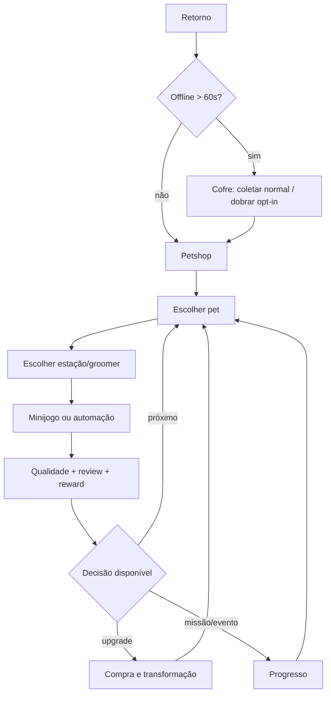

# UX Flow

## Primeiro minuto
`Splash (<2s) → Home-mundo → pet chega → pedido iconográfico → SERVIR pulsa → gesto fantasma → jogador esfrega → barra verde → FINALIZAR → Perfect → moedas voam → upgrade pulsa → pet sai feliz`.

No Core, Home é omitida deliberadamente para medir o verbo principal; a cena inicia no petshop. Nenhum modal de consentimento/loja antes do primeiro serviço; SDKs não essenciais inicializam após consentimento.

## Fluxo de sessão

## Navegação final
Home-mundo oferece BANHO, LOJA, EVENTO, COLEÇÃO, MAPA, MISSÕES como objetos no cenário; barra inferior aparece apenas fora do serviço. Back Android fecha modal → retorna Home → diálogo de saída somente se necessário. Estado de serviço é pausado em background.

## Estados obrigatórios
Loading com progresso real; vazio com próxima ação; offline com recursos degradados; erro recuperável e retry; compra pending/cancelada/restaurada; ad indisponível sem bloquear; fila cheia; save corrompido recuperado de backup.

## Ergonomia
Ação primária no terço inferior, alvo mínimo 48 dp e separação 8 dp. Progresso também usa texto/forma; haptic opcional; fonte 100/115/130%; safe-area top/bottom. Gestos têm alternativa de taps no modo motor assistido antes do VS.

## Monetização
Rewarded sheet: benefício, duração, limite e dois botões igualmente legíveis (“Assistir” / “Agora não”). IAP confirma preço local e conteúdo; restore visível. Interstitial não pode surgir em posição/tempo de input. No Ads explica exatamente o que remove.

## Analytics de UX
Cada passo registra entrada/conclusão/abandono sem coordenada bruta ou PII. Funil de tutorial, service_start/complete/fail, popup_view/action e tempo até primeiro upgrade. Heatmaps só com consentimento e ferramenta revisada.
